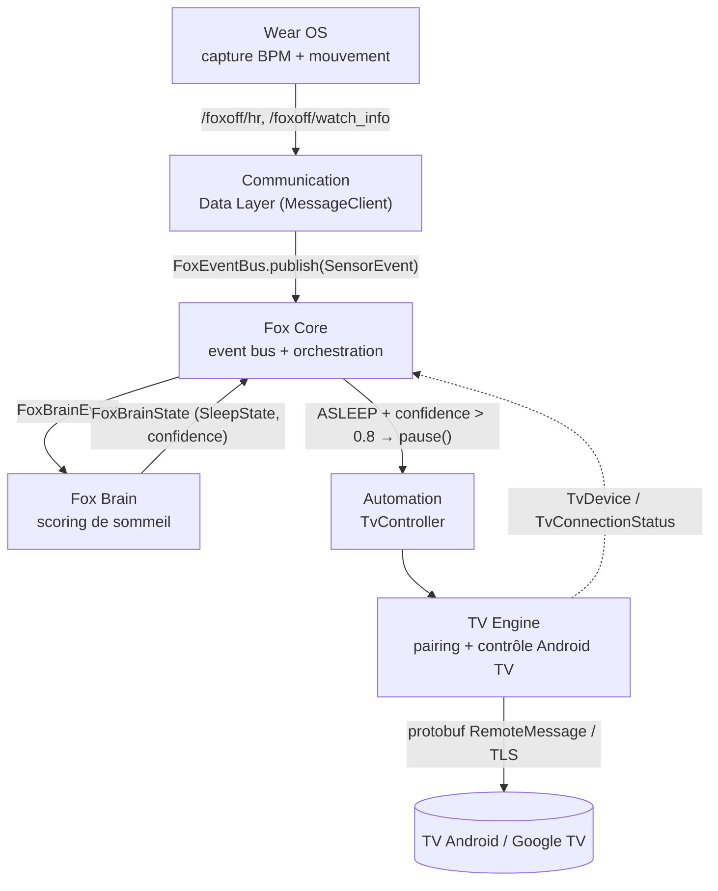
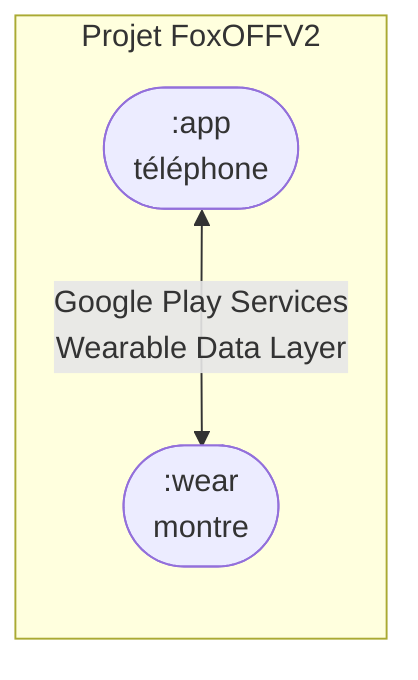
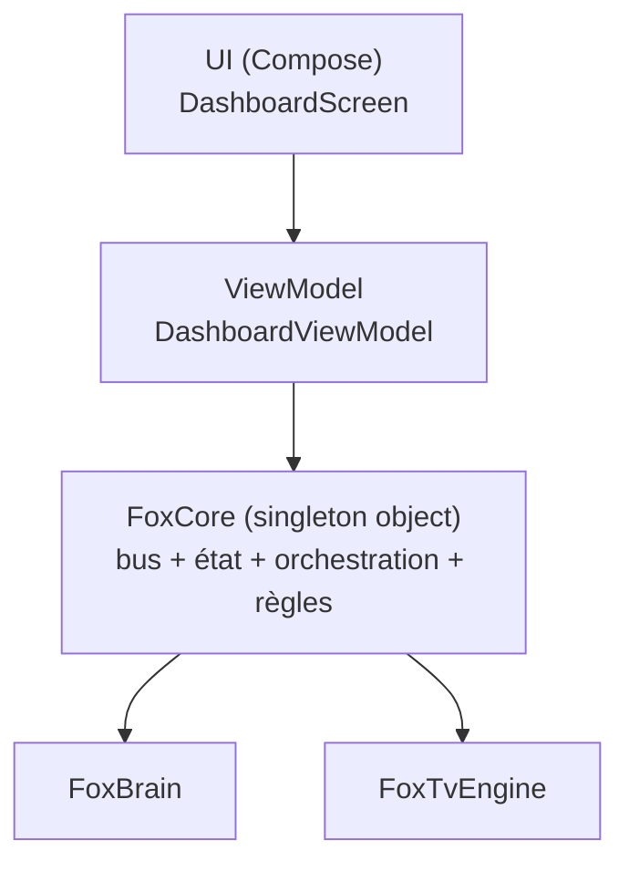
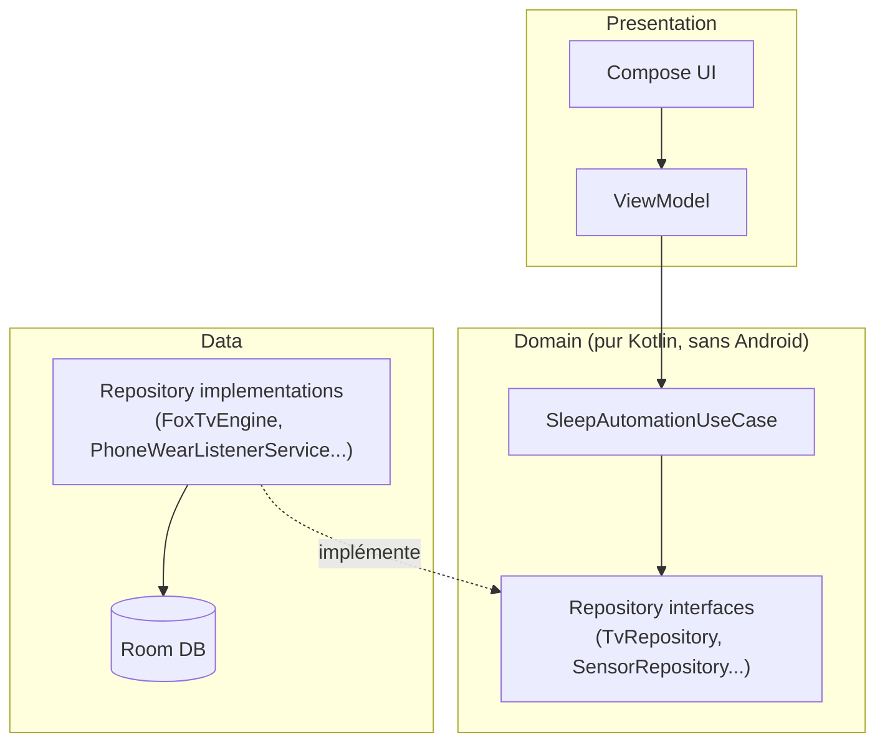

# FoxOFF — Architecture technique

> Décrit l'architecture **actuelle** (état réel du code, vérifié à la
> lecture) et l'architecture **cible** (après Phase 3 de
> [ROADMAP.md](ROADMAP.md)). Les deux sont clairement séparées ci-dessous —
> ne pas les confondre.

## 1. Vue d'ensemble — flux fonctionnel

Le flux métier traverse six zones de responsabilité, de la mesure physique à
l'action sur la TV :



**Lecture** : ce n'est pas un pipeline à sens unique. `Fox Core` est le point
de convergence — il reçoit les événements capteurs, les transmet au `Fox
Brain`, réagit à l'état renvoyé, et observe aussi en retour l'état du `TV
Engine` (TV allumée/éteinte, app en cours) pour l'injecter dans le `Fox
Brain` (ex. "TV allumée" augmente la probabilité de sommeil imminent). Voir
`FoxCore.startOrchestration()`.

## 2. Modules Gradle (état actuel)



| Module | Rôle | Application ID | Remarque |
|---|---|---|---|
| `:app` | Application téléphone : UI, orchestration, TV Engine, Fox Brain | `com.projectfox.foxoff` | Seul module applicatif actif aujourd'hui |
| `:wear` | Application Wear OS compagnon | `com.projectfox.foxoff` (même ID, requis pour l'appairage Wearable) | Squelette : permissions gérées, **aucune collecte capteur implémentée** (cf. [ROADMAP.md](ROADMAP.md) Phase 1) |

Il n'y a **aucun autre module** aujourd'hui (pas de `:core`, `:data`,
`:feature-*`). C'est un choix assumé pour la V2 initiale — voir
"Hilt avancé / modularisation Gradle" dans les décisions repoussées de
[ROADMAP.md](ROADMAP.md).

## 3. Packages — état actuel (`:app`)

```
com.projectfox.foxoff
├── MainActivity.kt                 — point d'entrée UI (Compose)
├── automation/                     — pont Fox Core → TV Engine
│   ├── TvController.kt             (interface)
│   └── RealTvController.kt         (impl. déléguant à FoxTvEngine)
├── brain/                          — Fox Brain : moteur de scoring de sommeil
│   ├── FoxBrain.kt                 (orchestrateur d'analyse, state holder)
│   ├── FoxBrainAnalyzer.kt         (interface Strategy)
│   ├── BasicBrainAnalyzer.kt       (impl. V1, seuils simples)
│   ├── WeightedSleepAnalyzer.kt    (impl. V2 active, scoring pondéré)
│   ├── SleepScoringConfig.kt       (constantes de calibration)
│   ├── FoxBrainEvent.kt / FoxBrainScore.kt / FoxBrainState.kt / SleepState.kt
├── core/
│   ├── application/
│   │   ├── FoxApplication.kt       (Application Android, démarre FoxCore)
│   │   └── FoxCore.kt              (God Object : bus + état + orchestration)
│   ├── diagnostics/FoxDiagnostic.kt
│   ├── events/FoxEvent.kt / FoxEventBus.kt
│   ├── logging/FoxLogger.kt
│   ├── module/FoxModule.kt         (interface non utilisée — cf. Dette technique)
│   └── service/PhoneWearListenerService.kt  (réception Data Layer)
├── sensors/
│   ├── events/SensorEvent.kt
│   └── model/HeartRateSample.kt, SensorBackend.kt
├── tv/                             — TV Engine
│   ├── FoxTvEngine.kt              (composition root du sous-système TV)
│   ├── FoxTvController.kt          (façade : togglePlayPause)
│   ├── TvDiscoveryManager.kt / TvDevice.kt / TvEvent.kt
│   ├── TvStateRepository.kt
│   ├── TvKeyStore.kt               (identité TLS — ancienne implémentation)
│   ├── TvPairingManager.kt         (pairing PIN, utilise le protobuf généré)
│   ├── TvConnectionManager.kt      (⚠ orphelin, cf. §6)
│   ├── TvCommandSender.kt          (⚠ orphelin, cf. §6)
│   ├── pairing/TvIdentity.kt       (identité TLS — nouvelle implémentation)
│   ├── pairing/TvPairingClient.kt
│   ├── protobuf/PoloFactory.kt, RemoteFactory.kt (⚠ stub vide), TvConstants.kt
│   └── remote/TvRemoteClient.kt    (canal de contrôle réellement utilisé)
├── tvlab/                          — écran de diagnostic manuel (hors flux prod)
│   ├── TvLabActivity.kt / TvLabConnection.kt / TvLabIdentity.kt / TvRemoteConnection.kt
├── ui/
│   ├── components/HexPinKeyboard.kt
│   ├── dashboard/  (Screen, ViewModel, UiState, RemoteScreen, components/)
│   ├── onboarding/ (Navigation, screens/, setup/, components/)
│   └── theme/      (Color, Theme, Type)
├── com.google.polo.wire.protobuf.PoloProto  — code généré protobuf (vendored, cf. §6)
└── remote.Remotemessage                     — code généré protobuf (vendored, cf. §6)
```

## 4. Couches — état actuel vs cible

### 4.1 État actuel : pas de séparation formelle

Aujourd'hui, `FoxCore` (`core/application/FoxCore.kt`) cumule quatre
responsabilités dans une seule classe `object` : bus d'événements, état
global (`watchInfo`), orchestration (démarre/arrête les modules) et **règles
de décision métier** (les seuils `0.70`/`0.80` qui déclenchent la pause TV).
Les ViewModels (`DashboardViewModel`) lisent directement `FoxCore.brain.state`
— il n'y a pas de couche domaine intermédiaire.



### 4.2 Cible (Phase 3 de la Roadmap) : domain / data / presentation



**Règle de dépendance cible** : `Domain` ne dépend d'aucune classe
`android.*` ni d'aucune classe `Data`/`Presentation` — c'est l'inverse
(`Data` implémente les interfaces de `Domain`, via injection Hilt). C'est ce
qui rend `SleepAutomationUseCase` testable sans émulateur. Cette cible n'est
**pas encore implémentée** — c'est l'objet de la Phase 3.

## 5. Dépendances externes significatives

| Dépendance | Usage | Statut |
|---|---|---|
| Jetpack Compose (+ BOM, Material3) | UI téléphone et montre | Adopté |
| `androidx.wear.compose` | UI montre | Adopté |
| `play-services-wearable` | Data Layer API (`MessageClient`, `NodeClient`) | Adopté, partiellement câblé (cf. Phase 1) |
| `androidx.health:health-services-client` | Capteurs Wear OS (BPM, activité) | **Dépendance présente, non utilisée** — cf. Phase 1 |
| `com.google.protobuf:protobuf-javalite` | Runtime des messages `PoloProto` / `Remotemessage` | Adopté, mais le **plugin Gradle protobuf n'est pas appliqué sur `:app`** — cf. §6 |
| BouncyCastle (`bcprov`, `bcpkix`) | Génération de certificats X.509 auto-signés pour le TLS Android TV Remote v2 | Adopté |
| Navigation Compose | Navigation de l'onboarding | Adopté |
| Hilt | Injection de dépendances | **Non présent** — planifié Phase 3 |
| Room | Persistance (historique, sessions) | **Non présent** — planifié Phase 3 |
| TensorFlow Lite | Modèle on-device | **Non présent** — repoussé Phase 8 |

## 6. Écarts constatés entre le code et son intention

Ces constats sont factuels (vérifiés en lisant le code) et alimentent la
dette technique de [ROADMAP.md](ROADMAP.md). Ils sont documentés ici pour
que l'architecture décrite reste honnête vis-à-vis de l'état réel.

- **Deux implémentations parallèles du canal de contrôle TV.** Le chemin
  réellement utilisé en production est `FoxTvEngine.pause()` →
  `FoxTvController.togglePlayPause()` → `tv/remote/TvRemoteClient.kt`, qui
  utilise correctement les classes protobuf générées (`Remotemessage`).
  `tv/TvConnectionManager.kt` (encodage manuel octet par octet) et
  `tv/TvCommandSender.kt` qui l'enveloppe ne sont référencés par **aucun**
  point d'entrée actif — ce sont des orphelins d'une itération précédente.
  `tv/protobuf/RemoteFactory.kt` est un objet vide. **Ce constat corrige un
  point de la Roadmap v2** — voir la section Cohérence ci-dessous.
- **Deux implémentations parallèles de l'identité TLS.** `TvKeyStore` (ancien)
  et `pairing/TvIdentity` (nouveau) génèrent et stockent chacun une paire
  clé/certificat RSA 2048 séparée, dans des `SharedPreferences` différentes
  (`foxoff_tv_identity_rsa_v1` vs `tv_lab_identity_v1`). `FoxTvEngine`
  garde `TvKeyStore` "temporairement... pour conserver la compatibilité"
  (commentaire du code) alors que le pairing et le contrôle actifs utilisent
  `TvIdentity`. À trancher avant la Phase 4.
- **Stockage des clés privées en clair (Base64) dans `SharedPreferences`**,
  dans les deux implémentations — ni Android Keystore, ni
  `EncryptedSharedPreferences`. Voir [RISKS.md](RISKS.md).
- **Confiance TLS "Trust On First Use" non renforcée après le pairing.** Le
  `TrustManager` de `TvIdentity.createSslContext()` accepte tout certificat
  serveur sans vérification (`checkServerTrusted` ne fait rien). Le code
  documente lui-même cette limite ("nous remplacerons ceci par une
  mémorisation/vérification de l'empreinte"). Voir [RISKS.md](RISKS.md).
- **Le plugin Gradle `protobuf` n'est pas appliqué sur `:app`.** Le fichier
  racine le déclare (`alias(libs.plugins.protobuf) apply false`) mais
  `app/build.gradle.kts` ne l'applique pas. Les classes générées
  (`PoloProto.java`, `Remotemessage.java`) sont donc **vendored** (copiées
  en dur dans `src/main/java`) plutôt que régénérées depuis `polo.proto` /
  `remotemessage.proto` à chaque build — une modification du `.proto` ne se
  propage pas automatiquement.
- **Nommage de fichier non conventionnel** :
  `tv/com.projectfox.foxoff.automation.FoxTvPauseAction.kt` porte un nom de
  fichier qualifié par un package, ce qui n'est pas la convention Kotlin
  standard (fichier = nom de la classe qu'il contient).
- **`TvKeyStore.exportCertificate()`** est explicitement documenté
  `TEMPORARY` dans le code et écrit un fichier de debug sur le stockage
  externe — à retirer avant publication.

## 7. Conventions actuelles

- **Préfixe `Fox`** pour les composants transverses/singletons du cœur
  applicatif : `FoxCore`, `FoxBrain`, `FoxLogger`, `FoxEventBus`,
  `FoxApplication`, `FoxDiagnostic`. Les composants métier d'un
  sous-système spécifique n'ont pas ce préfixe (`TvDevice`,
  `HeartRateSample`).
- **Suffixes porteurs de sens** : `Manager` (cycle de vie + I/O d'un
  sous-système : `TvPairingManager`, `TvDiscoveryManager`), `Engine`
  (composition root d'un sous-système : `FoxTvEngine`), `Repository` (état
  observable exposé en `StateFlow` : `TvStateRepository`), `Controller`
  (façade d'action : `TvController`).
- **Modèle d'état observable** : `StateFlow`/`MutableStateFlow` exposés en
  lecture seule (`asStateFlow()`), écrits uniquement depuis l'intérieur de
  leur propriétaire — respecté partout sauf à corriger dans `FoxCore` lors
  du refactor (Phase 3).
- **Logging** : tous les logs passent par `FoxLogger`, préfixés par zone
  (`FOX-TV`, `FOX-CORE`, `FOX-WATCH`, `FOX-PHONE`) — convention à conserver
  et formaliser dans [CONTRIBUTING.md](CONTRIBUTING.md).
- **Un fichier = une classe/objet public**, sauf exception historique notée
  en §6.

## 8. Règles de dépendances (cible, à partir de la Phase 3)

1. `domain` ne dépend jamais de `android.*`, ni de `data`, ni de
   `presentation`.
2. `data` implémente les interfaces définies par `domain` ; `data` peut
   dépendre d'Android (contexte, capteurs, réseau).
3. `presentation` (Compose + ViewModel) ne dépend que de `domain` (use
   cases), jamais directement de `data`.
4. Aucun package `tvlab` (outillage de diagnostic manuel) n'est référencé
   depuis un chemin de code de production (`brain`, `automation`,
   `core`) — il reste un outil de test isolé.
5. Le module `:wear` ne dépend jamais de `:app` ; toute communication passe
   par le Data Layer (`MessageClient`/`DataClient`), jamais par un import
   direct de classes.

Ces règles ne sont pas encore vérifiées automatiquement (pas de linter de
dépendances configuré) — à considérer si le projet se modularise
davantage, mais volontairement hors scope tant que ce n'est pas justifié
(voir décisions repoussées de la Roadmap).
